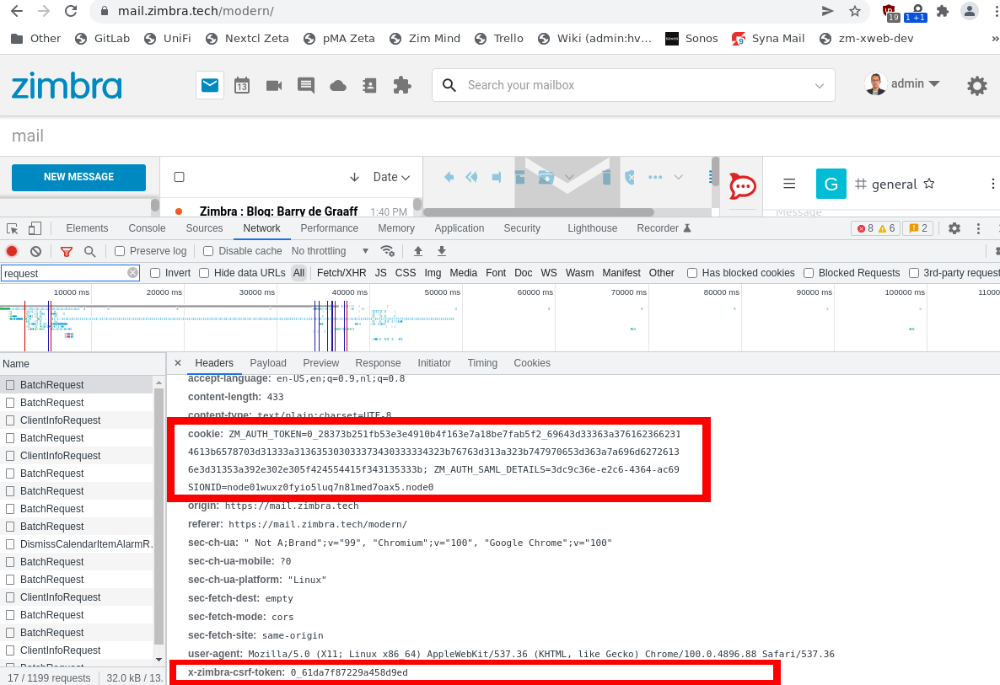

# Implementing a CSRF check on a Zimbra extension

In this article you will learn how to implement a CSRF check in a Zimbra extension. The Java project and source code can be found at https://github.com/Zimbra/zm-extension-guide.

In many cases the Cross-Origin-Resource-Policy in the web browser and the setting of the SameSite=Strict attribute on the authentication cookie will provide enough security for your extension. However in some cases you may want to implement an additional CSRF check in your extension. For example you may want to allow the posting of HTTP forms only from a specific domain in your organisation (and not allow subdomains). 

Here is an example implementation:

````java
 /**
  * Processes HTTP OPTIONS requests.
  *
  * Here is an example CSRF implementation, you may not need it for your application, also be aware of the following setting:
  * zmlocalconfig -e zimbra_same_site_cookie="Strict"
  *
  * In this demonstration case the CSRF check is implemented on the HTTP Options request, in reality you would probably implement it on HTTP Post and Get.
  *
  * You will also need to set zimbraCsrfAllowedRefererHosts if you want to implement a referer check:
  * zmprov mcf +zimbraCsrfAllowedRefererHosts "zimbra.example.com"
  *
  * Example request to test this CSRF implementation:
  * curl 'https://zimbra.example.com/service/extension/mytest' -X OPTIONS -H 'X-Zimbra-Csrf-Token: 0_3278....030b' -H 'Referer: https://zimbra.example.com/modern/email/Inbox/conversation/266' -H 'Cookie: ZM_AUTH_TOKEN=0_78fe8e....a313b;'
  *
  * @param req  request message
  * @param resp response message
  * @throws java.io.IOException
  * @throws javax.servlet.ServletException
  */

 @Override
 public void doOptions(HttpServletRequest req, HttpServletResponse resp) throws IOException, ServletException {
     //all authentication is done by AuthUtil.getAuthTokenFromHttpReq, returns null if unauthorized
     final AuthToken authToken = AuthUtil.getAuthTokenFromHttpReq(req, resp, false, true);
     if (authToken == null) {
         resp.getOutputStream().print("No or invalid Auth token received.");
         return;
     }
     String csrfToken = req.getHeader(Constants.CSRF_TOKEN);
     if (!StringUtil.isNullOrEmpty(csrfToken)) {
         resp.getOutputStream().print("No CSRF token received.");
         return;
     }

     //check for valid CSRF token
     if (!CsrfUtil.isValidCsrfToken(csrfToken, authToken)) {
         resp.getOutputStream().print("CSRF check FAILED.");
         return;
     }

     //do a CSRF referrer check
     String[] allowedRefHosts = null;
     Provisioning prov = Provisioning.getInstance();
     try {
         allowedRefHosts = prov.getConfig().getCsrfAllowedRefererHosts();
     } catch (Exception e) {
         resp.getOutputStream().print("getCsrfAllowedRefererHosts failed.");
         return;
     }

     if (isValidCsrfReferrer(req, allowedRefHosts)) {
         resp.getOutputStream().print("All CSRF checks passed.");
         //Add your code here
     } else {
         resp.getOutputStream().print("CSRF referrer checks FAIL.");
     }
 }


 public static boolean isValidCsrfReferrer(final HttpServletRequest req, final String[] allowedRefHost) {
     List<String> allowedRefHostList = Arrays.asList(allowedRefHost);
     String referrer = req.getHeader(HttpHeaders.REFERER);
     String refHost = null;

     URL refURL = null;
     try {
         refURL = new URL(referrer);
     } catch (Exception e) {
         return false;
     }
     refHost = refURL.getHost().toLowerCase();

     return allowedRefHost != null && allowedRefHostList.contains(refHost);
 }
````

## Testing the CSRF

To be able to test you will first need to obtain a valid ZM_AUTH_TOKEN and a valid CSRF token. The easiest way to obtain these is to log-in to your Zimbra test server, in the web browser open the Developer Console (F12), navigate to the network tab and copy/paste them for use with the `curl` command.



Example `curl` request:

```
curl 'https://zimbra.example.com/service/extension/mytest' \
     -X OPTIONS \
     -H 'X-Zimbra-Csrf-Token: 0_32786543c8a1da061a5294e011823dfe54e7030b' \
     -H 'Referer: https://zimbra.example.com/modern/email/Inbox/conversation/266' \
     -H 'Cookie: ZM_AUTH_TOKEN=0_78fe8ed6316247bbf0489b9443079e02462f36bf_69643d33363a37343130313033382d316632362d343734322d386565302d6237646539313162646164313b6578703d31333a313634383034303036353536383b747970653d363a7a696d6272613b753d313a613b7469643d393a3138323330363036313b76657273696f6e3d31333a392e302e305f47415f343137383b637372663d313a313b;'

```

Now you can change the `Referer` and `X-Zimbra-Csrf-Token` headers to simulate a malicious request. You can also alter the `ZM_AUTH_TOKEN` cookie to test the authentication implementation of your extension.
