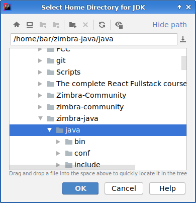
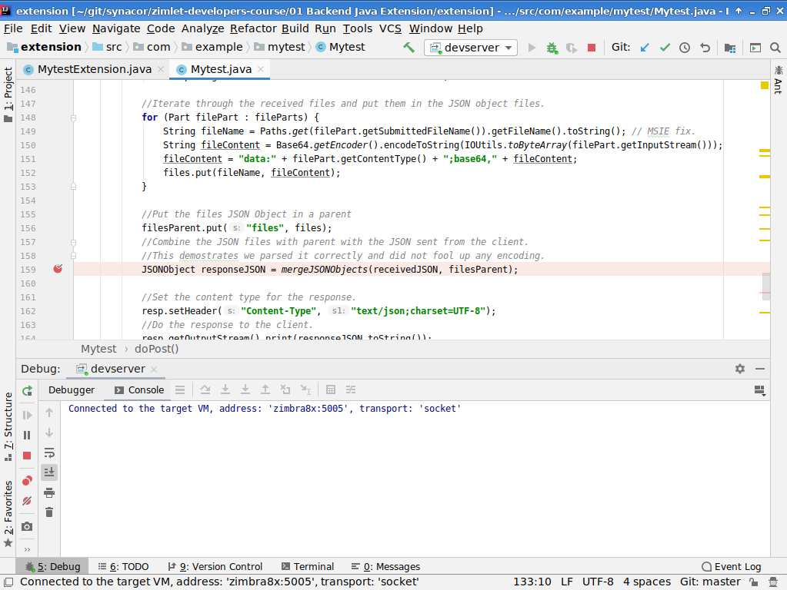

# Zimbra Back-End Extensions

One of the powers of Zimbra is the ability to be extended with custom functionality. The Zimbra front-end can be extended with JavaScript Zimlets and the back-end can be extended with Java extensions. This article is a practical guide to writing Zimbra back-end extensions.

If you have never wrote software before or find the Java code in this article overwhelming, you may find it helpful to follow a Java course first. Following such a course will help you understand the Java language fundamentals. Having good fundamentals will improve your coding and productivity. A good online course can be found at https://www.udemy.com/course/java-essential-training/

## Prerequisites 

To follow the steps in this article you need a Zimbra test server. You can set this up in a Virtual Machine in the cloud or you can install it on your local computer inside VirtualBox/KVM/Parallels etc. If you decide to set it up on your local computer you need at least an i5 with 16GB of RAM and a SSD. Your test server needs to be accessible over SSH. Instructions on how to set up your Zimbra server: https://blog.zimbra.com/2018/01/install-zimbra-collaboration-8-8-ubuntu-16-04-lts/ make sure to install the latest patches. You can find instructions on how to install patches at https://wiki.zimbra.com/wiki/Zimbra_Releases

## Zimbra extensions

Zimbra supports extensions for the following functionality:

  - REST API, HTTP GET/POST 
  - SOAP API, HTTP XML
  - Custom Authentication 
  - Change Password on custom authentication
  

| Extension | Description | Java Implementation | Example |
| ------ | ------ | ------ | ------ |
|  REST | Implements a REST API, if you need authentication you must manually implement it, supports file uploads. | Implements com.zimbra.cs.extension.ExtensionHttpHandler / javax.servlet.http.HttpServlet | Read below. |
|  SOAP | Implements a SOAP API, can only be accessed by authenticated users and can be tied to the regular front-end or the admin console. | Implements com.zimbra.soap.DocumentService | WebUI: https://github.com/Zimbra-Community/account-history/tree/master/extension/src/tk/barrydegraaff/accounthistory Admin console: https://github.com/Zimbra-Community/shared-mailbox-toolkit/tree/master/extension/example-extension |
|  Custom Authentication | Supports authenticating Zimbra users using a 3rd party auth back-end.  | Implements com.zimbra.cs.account.auth.ZimbraCustomAuth | https://github.com/silpion/zimbra-crowd-extension |
|  Change Password | This extension can be called whenever the user changes the account password. You can use this to change the password on a non-Zimbra auth back-end like Active Directory. | Extends com.zimbra.cs.account.ldap.ChangePasswordListener |  https://github.com/Zimbra-Community/ADPassword |
|  Custom store* | Allows to create additional storage back-ends for Zimbra. | extends ExternalStoreManager | https://github.com/Zimbra-Community/zimlets-foss/tree/master/ZimbraServer/examples/server-extensions/src/java/com/zimbra/examples/extns/storemanager |
|  Custom Authentication alternative* | This one does not technically implement a Zimbra server extension, but may be useful if one wants to implement SAML. | extends AuthProvider | https://github.com/Zimbra-Community/zimlets-foss/tree/master/ZimbraServer/examples/server-extensions/src/java/com/zimbra/examples/extns/samlprovider |
|  Sieve mail filter* | Allows customizing mail filters.  | extends AbstractActionCommand | https://github.com/Zimbra-Community/zimlets-foss/blob/master/ZimbraServer/examples/server-extensions/src/java/com/zimbra/examples/extns/sieveaction/DummyCustomDiscard.java |

Some additional information can be found in the `/opt/zimbra/docs` folder on your Zimbra mailbox node. Extensions marked with (*) are not commonly implemented, they may require some research and updating to work.


## REST vs SOAP

REST and SOAP can do a lot of the same things but in a different way. When using SOAP you must always use XML to make the request to the server and the server will respond in XML as well. With REST you have the freedom to define your request and response content. You can use GET parameters, POST HTML forms, POST XML or JSON data and upload/download (binary) files. 

One benefit of SOAP over REST in Zimbra extensions is that the authentication of the user is enforced by Zimbra in SOAP extensions. Which means you do not have to worry about authenticating the users of your SOAP extension.

REST extensions on the other hand are based on javax.servlet.http, a third party class that is used frequently in other Java projects. As such you may find it easier to find documentation and examples on the Internet. A REST extension can be made to authenticate the user, but it is also possible to interact with non-authenticated users. In recent years developers of commercial and social web applications seem to favor REST over SOAP, but in government and healthcare applications SOAP is still common. If you are writing a simple extension that only needs to parse a few options, using REST can seem more straight forward as it is a little easier to test and debug not having to create XML payloads for the requests and parse the XML response but it is a matter of personal preference.


This article will focus on REST extensions because of the support for JSON and file up- and downloads. Existing REST/SOAP Zimbra API documentation can be found at:

  - https://wiki.zimbra.com/wiki/Zimbra_REST_API_Reference
  - https://wiki.zimbra.com/wiki/SOAP_API_Reference_Material_Beginning_with_ZCS_8


## Structure of a Zimbra extension

Zimbra extensions are deployed using jar files. Jar files are in fact zip files containing compiled Java classes in a specific folder structure and a Manifest file. Here is an example:

      ├── com
      │   └── example
      │       └── mytest
      │           ├── Mytest.class
      │           └── MytestExtension.class
      └── META-INF
          └── MANIFEST.MF
   
Java Classes in a Zimbra extension are always part of a so called Java package. It this article the package is called `com.example.mytest`. This means the jar contains a folder `com`, with a subfolder `example` and a subfolder `mytest`. In the `mytest` folder should then be a `Mytest` file containing your Java code.

There should also always be a META-INF folder with a file called MANIFEST.MF that contains the Zimbra-Extension-Class parameter in our case:

      Zimbra-Extension-Class: com.example.mytest.MytestExtension

This tells Zimbra to look for the `MytestExtension` class file in the package `com.example.mytest`. In `MytestExtension` a new instance of `Mytest` is initialized. 


## Setting up your build system

You can develop Zimbra extensions on any OS that supports Java development. This article will include Linux commands you can run on CentOS/Fedora/Redhat and Ubuntu. If you run on a different OS reading these commands should help you understand what you must do to get started. 

Create a folder on your local computer to store the `Mytest` extension and install the utilities to build Java extensions:

      mkdir ~/zimbra_extension_course
      cd ~/zimbra_extension_course
      sudo yum install -y git ant make zip
      sudo apt install -y git ant make zip
      git clone https://github.com/Zimbra/zm-extension-guide

Next step is to copy the Java libraries from your test server to your local computer.


      mkdir ~/zimbra_extension_course/lib
      scp root@testserver:/opt/zimbra/lib/jars/* ~/zimbra_extension_course/lib
      
In this article we will show you how to use the Java Development Kit (JDK) from the test server on your local machine. You can use a different JDK, but doing it like this gives some extra certainty that the compiled extension will work on your test server.

      mkdir ~/zimbra-java
      cd ~/zimbra-java
      scp -r root@testserver:/opt/zimbra/common/lib/jvm/java ~/zimbra-java/

**Never deploy/package the jar files from the lib folder and the jdk as part of your extension, they are only used for building the extension on your local computer!**

## Building the extension

      cd ~/zimbra_extension_course
      export JAVA_HOME=~/zimbra-java/java/ && make

The output should be like this:

      ant jar
      Buildfile: ~/zimbra_extension_course/build.xml
      
      clean:
         [delete] Deleting directory ~/zimbra_extension_course/build
          [mkdir] Created dir: ~/zimbra_extension_course/build
      
      compile:
          [javac] Compiling 2 source files to ~/zimbra_extension_course/build
      
      jar:
            [jar] Building jar: ~/zimbra_extension_course/mytest.jar
      
      BUILD SUCCESSFUL
      Total time: 1 second

We will explain the build process later in the article.

## Deploying the extension

To deploy the extension to your test server, you must first create a folder on your test server:

      sudo mkdir /opt/zimbra/lib/ext/mytest
      
Then you can copy the extension to your test server and remove it from the local machine.

      scp ~/zimbra_extension_course/mytest.jar root@testserver:/opt/zimbra/lib/ext/mytest/ 
      rm -f ~/zimbra_extension_course/mytest.jar

To load the extension into Zimbra you have to restart Zimbra's mailbox process

      cd /tmp
      su zimbra 
      zmmailboxdctl restart
      
Monitor the log files while developing and deploying extensions. The relevant log files are:

| Log | Description | 
| ------ | ------ |
| /opt/zimbra/log/mailbox.log    | Contains the log for the mailbox process, including start/stop/restart of Zimbra's mailbox process. You can use this log to determine if your extension is loaded and initialized correctly. |
| /opt/zimbra/log/zmmailboxd.out | Contains the log for Java error messages, stack traces and also the output of Java'system.out.println() instruction, which you can use to log messages. |

To verify the extension is loaded:

      cat /opt/zimbra/log/mailbox.log | grep -i mytest
      
An output like this means all went well:
      
      2020-03-10 15:27:16,238 INFO  [main] [] extensions - extension com.example.mytest.MytestExtension found in /opt/zimbra/lib/ext/mytest/mytest.jar
      2020-03-10 15:27:16,284 INFO  [main] [] extensions - registered handler at /mytest
      2020-03-10 15:27:16,284 INFO  [main] [] extensions - Initialized extension MytestExtension: com.example.mytest.MytestExtension@com.zimbra.cs.extension.ZimbraExtensionClassLoader@45b32dfe
      
You can now visit https://testserver.example.com/service/extension/mytest to see the extension.

## Setting up IntelliJ IDEA 

IntelliJ is an integrated development environment (IDE). That has a lot of functionality to help you write better code. Just like a spell checker, IntelliJ will suggest improvements as you type. Notifies you if you use deprecated language features and most importantly it includes a real-time debugger that you can attach to Zimbra to debug problems in a live environment. This article will show you how to set-up your Zimbra extension project in Intellij. Here is a video that shows the features of IntelliJ: https://www.youtube.com/watch?v=GSKERVTMWqs 

Go to https://www.jetbrains.com/idea/download/ and install IntelliJ on your local computer.


*Click import new project.*


*Select the folder you created to store the `Mytest` extension.*


*Select Create project from existing sources.*


*Confirm the project name.*


*This step configures where IntelliJ can find the Java sources, it should be detected automatically.*


*This step configures where IntelliJ can find the Java libraries. Libraries are dependencies the `Mytest` extension needs to build and run. IntelliJ will find jar files recursively and enable them by default in this wizard. You should only check the library item that contains the libraries we added in ~/zimbra_extension_course/lib. Make sure to uncheck everything else! In this case there should only be one enabled lib item, that contains activation.jar...zookeer.jar.*


*You do not need to change anything in the module structure.*


*Remove all the SDK's from the project, it will not be removed from your local machine.*


*Verify all SDK's are removed.*


*Click the + to open the Add New SDK menu and click JDK.*



*Select the Java SDK we downloaded from the test server, it should be in ~/zimbra-java/java/*


*Give the SDK a name*


*Finish the import wizard.*


*Once the wizard completes, IntelliJ will start scanning the libraries/SDK etc. It needs to do this to be aware of the available Java classes and their methods. This process can take up to 5 minutes. Maybe time to get some coffee.*


*Once the scanning is complete, open Project Structure.*


*If you need to support older versions of Zimbra, you can lower the Project language level. The Project language level defines on what Java your extension can run. A level of 8 means the extension can run on Java version 8 and higher, but it will not be able to use features from higher Java versions. If you run a java extension that is compiled for a version of Java that is newer than the one running your Zimbra, you will experience mailbox start-up failures. The log will show something like:*

      java.lang.UnsupportedClassVersionError: com/example/example/exampleExtension has been compiled by a more recent version of the Java Runtime (class file version 57.0), this version of the Java Runtime only recognizes class file versions up to 55.0


*You do not need to change anything in the module structure.*


*You do not need to change anything in the libraries structure.*


*You do not need to change facets.*


*In one of the previous steps we compiled the `Mytest` extension to a jar file using `ant`. Basically the `ant` build method can be fully automated and is useful if you want to include your extension in a larger project. To be able to use IntelliJ's java debugger we configure Intellij to compile and create a jar as well. Click Add JAR->From modules with dependencies...*


*You can leave it with the defaults.*


*This screenshot shows you how the default set-up looks.*


*Remove all libraries by selecting all items that have `Extracted...jar` and click Remove. Be sure to leave the `compile output` item. Check the Include on build option.*


*Check the Show contents of elements option and click the zimbra_extension_course.jar in the middle column. This will give you the option to click the Use Existing Manifest button.*


*Select the ~/zimbra_extension_course/META-INF/MANIFEST.MF, please note that this manifest file is NOT used by the `ant` build process. This is explained in a further chapter.*


*Click the + in Output Layout and select File.*


*Select the static page.html from ~/zimbra_extension_course/resources/page.html.*


*Take a look at the final settings.*


*Build the extension from IntelliJ by clicking Build->Rebuild project.*


*If all is OK, you should see `Build completed successfully` in the left bottom status bar.*

## Configuring the Java debugger

To enable the live Java debugger you must do some steps on your local machine as well as your test server. We start by adding a Debug Configuration in IntelliJ.


*Open the 'Run/Debug Configuration' dialog in Intellij by clicking the Add Configuration... button.*


*Create a new `Remote` configuration by clicking + and remote.* 


*Give the configuration a name and put the FQDN or IP in the HOST field. Copy the contents of `Command line arguments for remote JVM` to clipboard. We will refer to this line as **IntelliJ options row**.*

Open an SSH connection with the user root to your test server.

      su zimbra
      zmcontrol stop
      exit
      cp /opt/zimbra/libexec/zmmailboxdmgr /opt/zimbra/libexec/zmmailboxdmgr.old 
      cp /opt/zimbra/libexec/zmmailboxdmgr.unrestricted /opt/zimbra/libexec/zmmailboxdmgr 
      cp /opt/zimbra/conf/localconfig.xml /tmp/
      
      nano /opt/zimbra/conf/localconfig.xml 
      
In localconfig.xml find the key mailboxd_java_options and _append_ to it in the value line the **IntelliJ options row** 

      su zimbra
      zmcontrol start

Allow the debugger in your firewall, on your test server:

      firewall-cmd --add-port=5005/tcp      
      iptables -A INPUT -p tcp -s 0/0 -m tcp --dport 5005 -j ACCEPT

**Do not ever enable the debugger in a production environment as this is a security issue!**


Added for reference this is how the final result looks in 8.8.15 patch 8:

```xml
 <key name="mailboxd_java_options">
 <value>-server -Dhttps.protocols=TLSv1,TLSv1.1,TLSv1.2 -Djdk.tls.client.protocols=TLSv1,TLSv1.1,TLSv1.2 -Djava.awt.headless=true -Dsun.net.inetaddr.ttl=${networkaddress_cache_ttl} -Dorg.apache.jasper.compiler.disablejsr199=true -XX:+UseG1GC -XX:SoftRefLRUPolicyMSPerMB=1 -XX:+UnlockExperimentalVMOptions -XX:G1NewSizePercent=15 -XX:G1MaxNewSizePercent=45 -XX:-OmitStackTraceInFastThrow -verbose:gc -Xlog:gc*=info,safepoint=info:file=/opt/zimbra/log/gc.log:time:filecount=20,filesize=10m -Djava.net.preferIPv4Stack=true -agentlib:jdwp=transport=dt_socket,server=y,suspend=n,address=*:5005</value>
```

## Enable multipart/form-data on Zimbra Extensions

On your test server set the MultipartConfig so that the `Mytest` extension can receive multipart/form-data requests. Append the following:

```xml
   <multipart-config>
   </multipart-config>
```

To the `ExtensionDispatcherServlet` in the files:

   - /opt/zimbra/jetty_base/etc/service.web.xml.in
   - /opt/zimbra/jetty_base/webapps/service/WEB-INF/web.xml

Restart Zimbra with `zmcontrol restart`. The final result looks like this on 8.8.15 patch 8:

```xml
  <servlet>
    <servlet-name>ExtensionDispatcherServlet</servlet-name>
    <servlet-class>com.zimbra.cs.extension.ExtensionDispatcherServlet</servlet-class>
    <async-supported>true</async-supported>
    <load-on-startup>2</load-on-startup>
    <init-param>
      <param-name>allowed.ports</param-name>
      <param-value>8080, 8443, 7071, 7070, 7072, 7443</param-value>
    </init-param>
  <multipart-config>
  </multipart-config>
  </servlet>
```

This will allow you to use HttpServletRequest.getPart() and HttpServletRequest.getParts() to get multipart/form-data parts. Without this config change you will need to use org.apache.commons.fileupload and do some manual processing, this is (encoding) error prone.

Further reading: 

   - https://stackoverflow.com/questions/2422468/how-to-upload-files-to-server-using-jsp-servlet
   - https://docs.oracle.com/javaee/6/api/javax/servlet/annotation/MultipartConfig.html
   - http://www.mastertheboss.com/javaee/servlet-30/uploading-a-file-with-a-servlet
   - https://en.wikipedia.org/wiki/Mojibake

If you do not want to make such a change on your production server, you can do a file upload using: https://github.com/Zimbra-Community/owncloud-zimlet/blob/soapServiceBarry/docconvert/extension/src/tk/barrydegraaff/docconvert/DocConvert.java

## MytestExtension.java

The `Mytest` extension only has 2 Java sources files, the first one `MytestExtension` is loaded by the `ExtensionDispatcherServlet` that finds this class via the Zimbra-Extension-Class parameter in the MANIFEST.MF. If you are interested in more details as to how this works you can read it in the code: https://github.com/Zimbra/zm-mailbox/tree/develop/store/src/java/com/zimbra/cs/extension

```java   
package com.example.mytest;

import com.zimbra.common.service.ServiceException;
import com.zimbra.cs.extension.ExtensionDispatcherServlet;
import com.zimbra.cs.extension.ZimbraExtension;

/**
 * This extension registers a custom HTTP handler with <code>ExtensionDispatcherServlet<code>
 */
public class MytestExtension implements ZimbraExtension {

    /**
     * Defines a name for the extension. It must be an identifier. Used for logging.
     *
     * @return extension name
     */
    public String getName() {
        return "MytestExtension";
    }

    /**
     * Initializes the extension. Called when the extension is loaded.
     *
     * @throws com.zimbra.common.service.ServiceException
     */
    public void init() throws ServiceException {
        ExtensionDispatcherServlet.register(this, new Mytest());
    }

    /**
     * Terminates the extension. Called when the server is shut down.
     */
    public void destroy() {
        ExtensionDispatcherServlet.unregister(this);
    }
}
```

This file is the same across most extensions, and typically you would find and replace Mytest with an new name of choosing to start going.

## Mytest.java

The `Mytest` file is where you would do your work to build your extension. It is initialized by the `ExtensionDispatcherServlet` that calls it via the `init()` method from `MytestExtension`. What Zimbra does is add some abstraction on top of javax.servlet.http (https://tomcat.apache.org/tomcat-5.5-doc/servletapi/javax/servlet/http/HttpServlet.html) which means you can override the doPost, doGet, doOptions methods. You also must override the getPath() method as to get a url path for your extension.

The working of the code is explained with in-code comments:
```java     
package com.example.mytest;

import com.zimbra.cs.extension.ExtensionHttpHandler;
import com.zimbra.cs.account.Provisioning;
import com.zimbra.cs.account.Account;
import com.zimbra.cs.account.AuthToken;
import com.zimbra.cs.account.Cos;

import java.io.*;
import java.nio.file.Paths;
import java.util.*;
import java.util.stream.Collectors;

import javax.servlet.ServletException;
import javax.servlet.http.Cookie;
import javax.servlet.http.HttpServletRequest;
import javax.servlet.http.HttpServletResponse;
import javax.servlet.http.Part;

import org.apache.commons.io.IOUtils;
import org.json.JSONException;
import org.json.JSONObject;

public class Mytest extends ExtensionHttpHandler {

    /**
     * The path under which the handler is registered for an extension.
     * return "/mytest" makes it show up under:
     * https://testserver.example.com/service/extension/mytest
     * @return path
     */
    @Override
    public String getPath() {
        return "/mytest";
    }
    /**
     * Processes HTTP GET requests.
     *
     * @param req  request message
     * @param resp response message
     * @throws java.io.IOException
     * @throws javax.servlet.ServletException
     */
    @Override
    public void doGet(HttpServletRequest req, HttpServletResponse resp) throws IOException, ServletException {
        //Fetch a static HTML from the JAR file.
        InputStream in = getClass().getResourceAsStream("/page.html");
        //Set the content type and charset for the response to the client.
        resp.setHeader("Content-Type", "text/html;charset=UTF-8");
        //Copy the contents of the static HTML to the response.
        in.transferTo(resp.getOutputStream());
    }

    /**
     * Processes HTTP POST requests.
     *
     * @param req  request message
     * @param resp response message
     * @throws java.io.IOException
     * @throws javax.servlet.ServletException
     */

    @Override
    public void doPost(HttpServletRequest req, HttpServletResponse resp) throws IOException, ServletException {
        //Read cookies and look for the ZM_AUTH_TOKEN cookie.
        String authTokenStr = null;

        Cookie[] cookies = req.getCookies();
        for (int n = 0; n < cookies.length; n++) {
            Cookie cookie = cookies[n];

            if (cookie.getName().equals("ZM_AUTH_TOKEN")) {
                authTokenStr = cookie.getValue();
                break;
            }
        }

        //Validate active user by parsing Zimbra AuthToken and read a cos value to see if its a valid user.
        Account account = null;

        if (authTokenStr != null) {
            try {
                AuthToken authToken = AuthToken.getAuthToken(authTokenStr);
                Provisioning prov = Provisioning.getInstance();
                account = Provisioning.getInstance().getAccountById(authToken.getAccountId());
                Cos cos = prov.getCOS(account);
                Set<String> allowedDomains = cos.getMultiAttrSet(Provisioning.A_zimbraProxyAllowedDomains);
                //In case no exception was thrown, it is a valid user.
            } catch (Exception ex) {
                //This was not a valid authtoken.
                ex.printStackTrace();
                return;
            }
        } else {
            //There was no authtoken found.
            return;
        }

        try {
            //Get the jsondata field from the multipart request send to the server and parse it to JSON Object.
            JSONObject receivedJSON = new JSONObject(IOUtils.toString(req.getPart("jsondata").getInputStream()));

            //Initialize some variables to hold the binary files posted to the server.
            JSONObject filesParent = new JSONObject();
            JSONObject files = new JSONObject();

            //Retrieves <input type="file" name="filesToUpload[]" multiple="true">
            List<Part> fileParts = req.getParts().stream().filter(part -> "filesToUpload[]".equals(part.getName()) 
              && part.getSize() > 0).collect(Collectors.toList());

            //Iterate through the received files and put them in the JSON object files.
            for (Part filePart : fileParts) {
                String fileName = Paths.get(filePart.getSubmittedFileName()).getFileName().toString(); // MSIE fix.
                String fileContent = Base64.getEncoder().encodeToString(IOUtils.toByteArray(filePart.getInputStream()));
                fileContent = "data:" + filePart.getContentType() + ";base64," + fileContent;
                files.put(fileName, fileContent);
            }

            //Put the files JSON Object in a parent
            filesParent.put("files", files);
            //Combine the JSON files with parent with the JSON sent from the client.
            //This demonstrates we parsed it correctly and did not fool up any encoding.
            JSONObject responseJSON = mergeJSONObjects(receivedJSON, filesParent);

            //Set the content type for the response.
            resp.setHeader("Content-Type", "text/json;charset=UTF-8");
            //Do the response to the client.
            resp.getOutputStream().print(responseJSON.toString());

        } catch (Exception e) {
            e.printStackTrace();
        }
    }

    //Helper method to combine JSON objects
    public static JSONObject mergeJSONObjects(JSONObject json1, JSONObject json2) {
        JSONObject mergedJSON = new JSONObject();
        try {
            mergedJSON = new JSONObject(json1, JSONObject.getNames(json1));
            for (String crunchifyKey : JSONObject.getNames(json2)) {
                mergedJSON.put(crunchifyKey, json2.get(crunchifyKey));
            }

        } catch (JSONException e) {
            throw new RuntimeException("JSON Exception" + e);
        }
        return mergedJSON;
    }
}
```

## Working with IntelliJ debugger

Make sure the jar file on the server contains the same Java classes as available to IntelliJ. To make this happen you should recompile the jar from IntelliJ, copy it to your server and restart mailbox. To start debugging first place a couple of breakpoints in your code, you can do this by clicking on the area right of the line number in the Java code. A red ball indicates a breakpoint.


*Breakpoint at line 159 `JSONObject responseJSON = mergeJSONObjects(receivedJSON, filesParent);`.*


*Click the green bug button next to `devserver`. A console should pop-up saying Connected to the target VM. Also take a look at the breakpoint, there should now be a checkmark on top of the red ball. If it is some other icon, hover over it to see what the problem can be.*


*Go to the extension url and submit the form.*

You will notice that the form will hang in the browser, and eventually a time-out from the Zimbra Proxy will occur. This is not an issue, as the request will be processed by the back-end anyway. While debugging you probably want to set a couple of breakpoints at code you want to investigate. Each time you are done looking at the variables you can press F9 (Mac: Cmd + ALT + R) to resume program execution till the next breakpoint.

More information about the debugger: https://www.youtube.com/watch?v=1bCgzjatcr4


## Compiling with ant build.xml

Even though you could use IntelliJ to create the jar files for your extension, it is recommended you also set up `ant` or some other means to automate and document your build process. This makes it easier for others to compile your project. It also allows you to have version control on your build configuration. Below is the example `build.xml` used to compile `Mytest` extension. Please note that it includes the `lib` folder that we have set up manually. In `Mytest` the Java language target and source are set to 13. If you need to support older versions of Zimbra you should set the target and source values to the corresponding version of Java you wish to support. Please note that the manifest file is created from the parameters in build.xml it is not copied from elsewhere. The page.html and build output on the other hand are copied from their respective folders.

```xml
<project name="mytest" default="jar" basedir=".">
    <description>
        Build file for the Zimbra Extension.
    </description>

    <property name="lib"   value="lib/"/>
    <property name="build" value="build/"/>
    <property name="src"   value="src/"/>
    <property name="jar"   value="mytest.jar"/>

    <path id="libraries">
        <fileset dir="${lib}" >
            <include name="*.jar"/>
        </fileset>
    </path>

    <target name="clean">
      <delete dir="${build}"/>
      <delete file="mytest.jar"/>
      <mkdir dir="${build}"/>
    </target>

    <target name="compile"
            depends="clean">
        <javac srcdir="${src}"
               destdir="${build}"
               includeantruntime="false"
               debug="true"
               debuglevel="lines,vars,source"
               target="13"
               source="13">
            <classpath>
                <path refid="libraries" />
            </classpath>
        </javac>
    </target>

    <target name="jar"
            depends="compile">
        <jar jarfile="${jar}"
             compress="false"
             basedir="${build}">
            <manifest>
                <attribute name="Zimbra-Extension-Class" value="com.example.mytest.MytestExtension" />
            </manifest>
            <fileset dir="${build}" />
            <fileset file="resources/page.html" />
        </jar>
    </target>

</project>
```

In the open source projects people are often used to building software using GNU make. To support this you can add a wrapper `makefile`.  Which allows building the project with the commands we used in this article. Without using GNU make you can also compile the software using `export JAVA_HOME=~/zimbra-java/java/ && ant jar` or if you have a java in your path already using `ant jar`.


```makefile
all: extension

extension:
	ant jar

clean:
	rm -f mytest.jar

.PHONY: all extension

```

## Git and gitignore

In the projects sources you will find some .gitignore files. These files tell the git versioning system what files and folders should be ignored when you commit changes to git. This helps you to prevent accidental committing of binaries to the versioning system.

```gitignore
build
lib
mytest.jar
.idea
*.iml
openjdk*
java*
out

```
